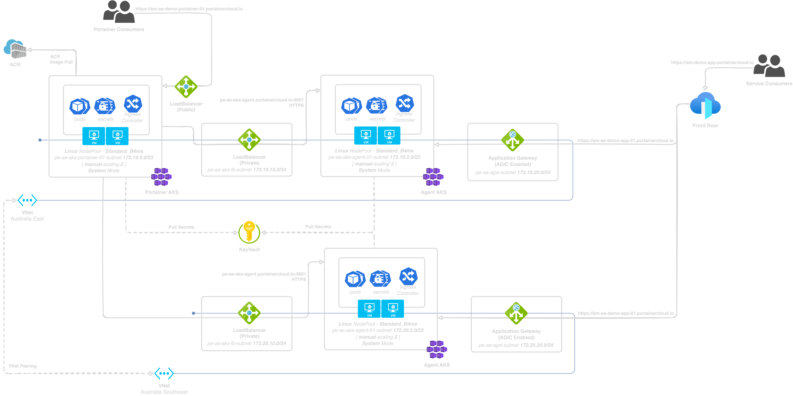

# Demonstration Steps

1. Overview of the demo



2. Install Portainer using the Helm chart from the Portainer GitHub repository

```sh
helm repo add portainer https://portainer.github.io/k8s
helm upgrade --install --atomic --namespace portainer --create-namespace portainer \
  --values ./azure/aks/portainer/values.yaml \
  portainer/portainer
```

3. Walkthrough of the Portainer UI

4. Configure Azure ACR registry credentials in Portainer
    * Name: `peazuremeetupacr`
    * URL: `peazuremeetupacr.azurecr.io`
    * Service Principal ID: `******`
    * Service Principal Secret: `******`

5. Deploy Portainer Agents across Australia East and Australia Southeast using AKS GitOps feature
    * Kustomizations
      * Australia East
        * `shared` - `./azure/aks/gitops/shared`
        * `prerequisites` - `./azure/aks/gitops/clusters/pe-ae-aks-agent/prerequisites`
        * `infrastructure` - `./azure/aks/gitops/clusters/pe-ae-aks-agent/infrastructure`
      * Australia Southast
        * `shared` - `./azure/aks/gitops/shared`
        * `prerequisites` - `./azure/aks/gitops/clusters/pe-as-aks-agent/prerequisites`
        * `infrastructure` - `./azure/aks/gitops/clusters/pe-as-aks-agent/infrastructure`

6. Add the Portainer Agents to the Portainer UI
    * Australia East
      * Name: `pe-ae-aks-agent.portainercloud.io`
      * Endpoint: `pe-ae-aks-agent.portainercloud.io:9001`
    * Australia Southeast
      * Name: `pe-as-aks-agent.portainercloud.io`
      * Endpoint: `pe-as-aks-agent.portainercloud.io:9001`

7. Pull and push `stefanprodan/podinfo:latest` image to the Azure ACR registry as `peazuremeetupacr.azurecr.io/podinfo:latest`
    * Execute:

```sh
docker image pull --platform linux/amd64 stefanprodan/podinfo:latest
docker image tag stefanprodan/podinfo:latest peazuremeetupacr.azurecr.io/podinfo:latest
docker image push peazuremeetupacr.azurecr.io/podinfo:latest
```

8. Deploy a sample application to the AKS cluster in Australia East using Portainer UI form
    * Create an Application with the image `peazuremeetupacr.azurecr.io/podinfo:latest`
    * Expose the application on port 9898
    * Create an Ingress rule for the application with the host `am-ae-demo-app-01.portainercloud.io` using the TLS secret `dev-podinfo-tls`
      * Annotation: `appgw.ingress.kubernetes.io/ssl-redirect: "true"`
      * `cert-manager` was used to provision the TLS secret as part of the GitOps deployment
    * Access https://am-ae-demo-app-01.portainercloud.io

9. Deploy a sample application to the AKS cluster in Australia Southeast using Portainer manifests form
    * The manifest path is `./azure/aks/manifests/application.yaml`
    * `cert-manager` was used to provision the TLS secret as part of the GitOps deployment
    * Access https://am-as-demo-app-01.portainercloud.io

10. Finally, access https://am-demo-app.portainercloud.io to demonstrate traffic being routed to both clusters using Azure Front Door
